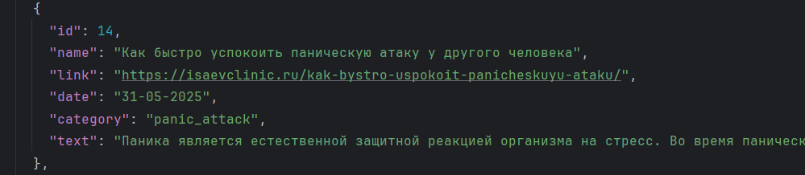
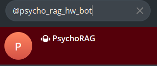
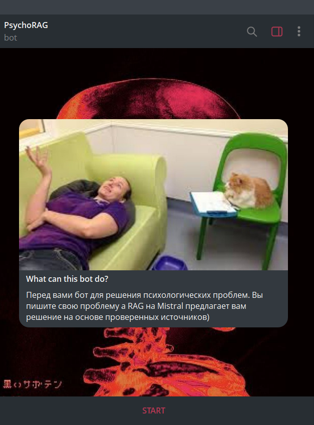
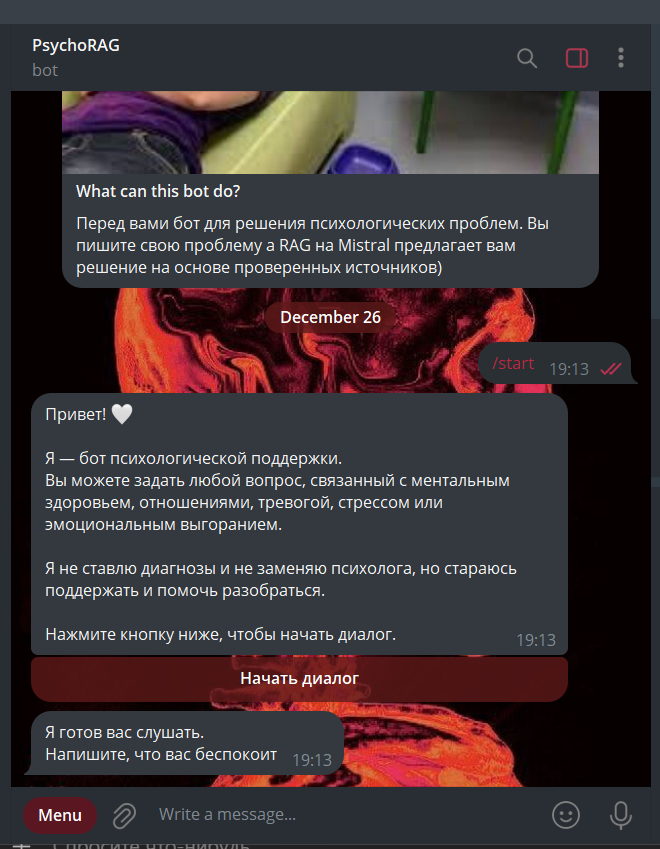

# Психологический РАГ

## Команда "Ты не один, ты с девочками!"

# Данные

## Источник данных

- Статьи психологической помощи из открытых источников в интернете от психологов/психологических журналов
- Научные статьи, доказывающие достоверность и эффективность представленных техник

Данные собирались ручным способом через проверенные источники в интернете.
Научные статьи брались с 2021 года для сбора актуальных данных и исследований.

## Сбор данных

Все данные собраны в единую структуру в директории `/data/`.
В директории `data/articles` представлены тексты всех статьей.<br>
Данные оформлены в json формат следующего вида:

```
{
  "rows": [
    {
      "id": 1,   # id источника
      "name": "Как справиться с депрессией самостоятельно",    # вопрос
      "link": "https://medscannet.ru/blogmed/kak-vyjti-iz-depressii/",    # ссылка
      "date": "08-09-2025",    # дата создания статьи
      "category": "depression",   # категория
      "text": "<текст статьи>"  # текст статьи
    },
```

### Статьи представлены по следующим категориям:

- депрессия
- тревожность
- выгорание
- панические атаки
- стресс/сильные эмоции
- категория для научных статей

Итоговая версия json файла хранится в `/data/final_dataset.json`.<br>
Доступ к статьям можно получить по указанным ссылкам и/или из указанной выше директории с текстами.

## Подготовка данных для RAG/LLM/агента

- Данные структурированы в единый json
- Написан пайплайн для векторизации данных
- Написаны классы для запуска ответа системы в заранее заданном формате ответа. Создана RAG-архитектура (`model.py`)
- Система протестирована на тестовых кейсах (`test_pipeline.py`)

# Тестирование

Тестирование проводится по нескольким пунктам:

1. Соответствие техническому заданию

- Проверка структуры ответа
- Валидность ссылок
- Соответствие ответа и ссылки заданному вопросу <br>
  Все эти пункты проверяются на наших ТК (`test_pipeline.py`)<br>

2. Эмпатичность и "психологическая квалификация" агента (RAG должен поддерживать пользователя, не ставить диагнозы, не
   рекомендовать препараты)

- llm is a judge для автоматизации оценки модели, чтобы проверить терапевтическую безопасность, постановку диагнозов,
  эмпатию, корректность отказов, выход за домен психологии.<br>
  Датасет для проверки точности и эматичности модели был составлен вручную
  Валидность ответа будет проверяться с помощью метрики BLEU<br>

3. Тест на безопасность RAG. Созданный RAG должен соответствовать следующим требованиям безопасности:

- Отсутствие harmful ответов (туда же относится постановка психологических диагнозов).
- Ответ на только вопросы, связанные с психологией (в противном случае - модель должна просить сменить тему)<br>
  На данный момент планируется ручная проверка и BLEU с кастомым датасетом вопросов для "взлома".
- RAGAS с кастомным датасетом из 10 вопросов для оценки качества работы RAG

### Пайплайн тестирования

## Валидность ссылок

Пример ответа от бота:<br>

<br><br> Источник в нашем датасете

Как видно, такая ссылка существует, а заголовок и текст статьи соответствуют запросу пользователя.<br>
Полная проверка находится в `test_pipeline.py`.

## Метрики качества

Собран бенчмарк из 100 вопросов, разных тематик.<br>
Тематики вопросов смешанные, каждый вопрос может относиться к нескольким категориям.
Пример семпла из бенчмарка:

```    
    {
      "id": 28,
      "question": "Может ли тревога проявляться через телесные ощущения?",
      "expected_theme": "anxiety",
      "allowed_topics": ["anxiety", "panic_attack"]
    }
```

`expected_theme` - основная тема вопроса <br>
`allowed_topics` - категории статей, которые релевантны вопросу <br>

### Тестирование ретривера

Мы взяли k = 3 - количество статей, используемых ботом для ответа на вопрос.
Проходимся по всем вопросам из бенчмарка, смотрим на документы, которые выбрал ретривер. Считаем статью релевантной
запросу, если ее категория содержится в allowed_topics. <br>
Метрики для оценивания ретривера:

1. Hit@3 - есть ли среди трех документов хотя бы один релевантный
2. Precision@3 - доля релевантных документов из трех
3. MRR@3 - насколько высоко в результатах поиска появляется первый релевантный документ (1 если на 1-м месте, 1/2 - на
   втором, 1/3 - на третьем, 0 - если нет релевантных документов). <br>
   Приведены результаты на общем датасете и по основным темам вопросов

```
== OVERALL METRICS ===
Hit@3: 0.938
Precision@3: 0.771
MRR@3: 0.883

=== PER-THEME METRICS ===

[depression]
  Hit@3: 1.000
  Precision@3: 0.983
  MRR@3: 1.000

[anxiety]
  Hit@3: 0.800
  Precision@3: 0.433
  MRR@3: 0.608

[panic_attack]
  Hit@3: 1.000
  Precision@3: 0.867
  MRR@3: 0.950

[stress]
  Hit@3: 1.000
  Precision@3: 0.800
  MRR@3: 1.000

[burnout]
  Hit@3: 0.900
  Precision@3: 0.800
  MRR@3: 0.900

[paper]
  Hit@3: 1.000
  Precision@3: 0.867
  MRR@3: 1.000
```

### Тестирование качества ответов бота (LLM-судья)

Системный промпт для судьи представлен в блокноте `eval/llm_judge.ipynb`.<br>

```
PASS RATE: 0.94 - доля ответов модели, которые были оценены судьей на максимальный балл по всем критериям.
```

Метрики показали хорошее качество ретривера и модели.

## Описание экспериментов

| Ошибка                                                                    | Решение                                                                                                                                       |
|---------------------------------------------------------------------------|-----------------------------------------------------------------------------------------------------------------------------------------------|
| Вне зависимости от тематики вопроса модель прикрепляла ссылку на документ | Добавили в промпт "Если вопрос не касается психологии или ментального здоровья, вежливо откажись отвечать, вместо ссылки напиши 'Не найдено'" | 
| Модель отвечала отдельно на каждый вопрос пользователя и переспрашивала   | Добавили memory                                                                                                                               |
| Модель давала однотипные и неэмпатичные ответы                            | Заменили на бОльшую модель                                                                                                                    |

# Репозиторий проекта

## Архитектура проекта

PsychologicalRAG/ <br>
│ <br>
├── data/ # Данные и датасеты <br>
│ ├── articles/ # Сырые статьи (источники) <br>
│ ├── base_data.json # Базовый датасет (сырой) <br>
│ ├── base_data_copy.json # Резервная копия <br>
│ └── final_dataset.json # Финальный датасет для RAG <br>
│ <br>
├── faiss_index/ # Векторное хранилище <br>
│ ├── index.faiss # FAISS индекс <br>
│ └── index.pkl # Метаданные FAISS <br>
│ <br>
├── parse_scripts/ # Подготовка данных
│ ├── download_articles.py # Загрузка статей <br>
│ └── build_base_data_json.py <br>
│ <br>
├── eval/ # Оценка качества RAG <br>
│ ├── eval_retr.py # Retrieval evaluation <br>
│ ├── test_pipeline.py # End-to-end тесты <br>
│ ├── psychrag_bench_100.json <br>
│ ├── judge_results.json # Результаты LLM-оценки <br>
│ ├── llm_judge.ipynb # Судья на LLM <br>
│ └── test_retr.ipynb <br>
│ <br>
├── readme_screenshots/ # Скриншоты для README <br>
│ <br>
├── bot.py # Точка входа (бот) <br>
├── model.py # Основная логика RAG <br>
├── Dockerfile # Docker-образ <br>
├── docker-compose.yml # Docker Compose <br>
├── requirements.txt # Зависимости <br>
├── .env # API-ключи <br>
└── README.md # Документация проекта <br>

## Взаимодействие компонентов

Пользователь → Telegram-бот (bot.py)<br>
↓<br>
bot.py.send_message()<br>
↓<br>
PsychologistRAG.ask()<br>
↓<br>
FAISS → max_marginal_relevance_search(question)<br>
↓<br>
Извлечённые chunks + metadata + memory<br>
↓<br>
PromptTemplate (контекст + правила психолога)<br>
↓<br>
ChatMistral (LLM)<br>
↓<br>
JsonOutputParser → Pydantic → PsychoResponse<br>
↓<br>
bot.py возвращает JSON-содержание<br>
↓<br>
Пользователь получает структурированный ответ<br>

## Список зависимостей проекта

<b>LLM-модель:</b> "mistral-large-latest" <br>
<b>Трансформер для создания эмбеддингов:</b> "sentence-transformers/paraphrase-multilingual-MiniLM-L12-v2" <br>
<b>Требуемая версия python:</b> 3.13 <br>
Список используемых библиотек указан в requirements.txt

```console
pip install -r requirements.txt
```

<b>Основные используемые библиотеки:</b>

- `aiogram` - пользовательский интерфейс (тг бот)
- `langchain` - создание RAG-архитектуры
- `faiss-cpu`, `langchain-text-splitters` - векторизация датасета
- `pydantic` - структура ответа RAG

## Создание пользовательского интерфейса

- Создан класс, реализующий пользовательский интерфейс в виде телеграм бота (`aiogram`).
- Проведено ручное тестирование бота.
- Собран docker образ для запуска.

## Инструкции по запуску

Проект собран в docker образ (только файлы, необходимые для запуска бота, тестирование не добавляли) `Dockerfile` и
`docker-compose.yml` и готов для запуска (для этого требуется установленный docker desktop).<br>
Образ можно собрать командой

```bash
docker build -t psychological-rag .
```

Мы собирали в директории из pycharm

```bash
docker-compose build
```

После запуска команды должно появиться сообщение `✔ psychrag  Built` - сборка прошла успешно.<br>
Запуск контейнера

```bash
docker run --env-file .env psychological-rag
```

Мы запускали в директории из pycharm

```bash
docker-compose up
```

При успешном запуске в консоли должно появиться сообщение `Attaching to psychological_rag`, далее можно следовать
руководству пользователя - бот запущен, можно начинать переписку.
Может появиться warning ConversationBufferMemory, тк мы используем новую версию langchain, миграция memory там в
процессе.

# Руководство пользователя

Необходимо ввести в поиске телеграмма `@psycho_rag_hw_bot` и перейти в бот, нажать на кнопку `/start`,
появится приветственное сообщение с описанием функционала бота. Далее пользователь может ввести свой психологический
запрос, RAG отправит в ответ сообщение, состоящее из психологической поддержки,
совета по решению данной проблемы и ссылку на источник с советом. При вводе запроса, не связанного с психологией, бот
вежливо попросит сменить тему.

## Функционал интерфейса

RAG имеет пользовательский интерфейс в виде телеграм бота.<br>

1. Поиск бота в telegram <br>
   
2. Приветственное сообщение от бота<br>
   
3. Начало диалога<br>
   
4. Пример ответа на сообщение <br>
   
5. Пример работы Memory <br>
   

# Участницы команды

- Григорьева Дарья Дмитриевна
- Сабирова Миляуша Марселевна
- Зинякова Екатерина Максимовна
- Денисова Карина Андреевна